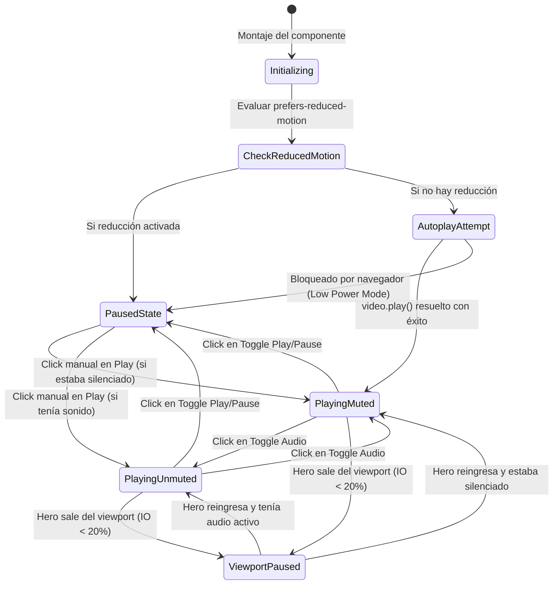
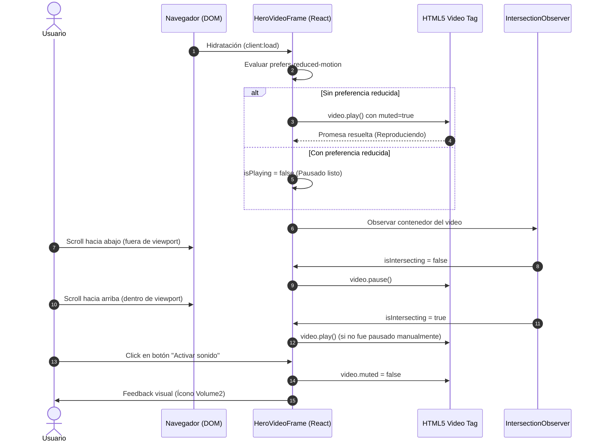

# Plan Técnico: Hero Video Showcase (Hero Dividido con Video Frame)

**ID:** TECH-HERO-VIDEO-001  
**Versión:** 1.0.0  
**Fecha:** 2026-09-24  
**Referencia:** [SPEC-HERO-VIDEO-001](file:///c:/Users/santi/Documents/GitHub/quincho-raices/docs/specs/hero-video-showcase/spec.md)  
**Stack:** Astro v7, Tailwind CSS v4, React 19 (`@astrojs/react`), Motion (`motion/react`), Lucide React.  

---

## 1. Arquitectura de Componentes & Límites de Responsabilidad (Seams)

Siguiendo los principios de **Clean Architecture** y **Deep Modules**, separamos claramente la renderización estática (Astro SSG para SEO y LCP veloz) del comportamiento interactivo del reproductor de video (React Island para micro-interacciones, control de audio y observers).

```
src/
├── components/
│   ├── Hero.astro              <-- [Orquestador SSG] Layout en 2 columnas, SEO, fondos, textos
│   └── HeroVideoFrame.tsx      <-- [React Island] Deep Module: video, controls, IO, a11y
└── styles/
    └── global.css              <-- Clases de glow, marcos de cristal y reduced-motion
```

### 1.1. `Hero.astro` (Orquestador Estructural)
- **Rol:** Define el layout responsivo (`grid` en desktop, flex vertical en mobile).
- **Contenido Izquierdo:** Badge de ubicación, tipografía H1 con `HeroTextRotator.tsx`, descripción, CTAs principales (WhatsApp, Ver Instalaciones), enlaces rápidos y chips de valor.
- **Contenido Derecho:** Renderiza la isla interactiva `<HeroVideoFrame client:visible />` o `client:load`. Se recomienda `client:load` en el Hero debido a que es el elemento por encima del pliegue (Above the Fold) y asegura que los eventos de autoplay se ejecuten inmediatamente sin desfasaje visual.
- **Ventaja de Seam:** Si en el futuro se reemplaza el componente de video o se añade un visor 3D, el Hero solo cambia la inclusión del componente sin modificar la lógica estructural.

### 1.2. `HeroVideoFrame.tsx` (Deep Module Interactivo)
- **Interfaz Simple hacia afuera:**
  ```tsx
  interface HeroVideoFrameProps {
    src?: string;
    poster?: string;
    className?: string;
  }
  ```
- **Complejidad Oculta adentro:**
  - Control de reproducción HTML5 (`play()`, `pause()`, `muted`).
  - Detección de Intersection Observer para desconectar playback fuera de pantalla.
  - Sincronización con `prefers-reduced-motion` mediante `window.matchMedia`.
  - Manejo de excepciones por políticas de autoplay de navegadores (iOS Low Power Mode).
  - Micro-animaciones en botones de control y badges con Lucide Icons y `motion/react`.

---

## 2. Diagrama de Arquitectura y Ciclo de Vida

### 2.1. Diagrama de Estados del Reproductor



### 2.2. Secuencia de Inicialización e Interacción



---

## 3. Especificación Técnica de la Implementación

### 3.1. Estructura de la Isla `HeroVideoFrame.tsx`

```tsx
import React, { useRef, useState, useEffect, useCallback } from 'react';
import { Volume2, VolumeX, Play, Pause, Sparkles } from 'lucide-react';
import { motion, AnimatePresence } from 'motion/react';

export interface HeroVideoFrameProps {
  src?: string;
  poster?: string;
  className?: string;
}

export const HeroVideoFrame: React.FC<HeroVideoFrameProps> = ({
  src = '/videos/general-qr.mp4',
  poster,
  className = '',
}) => {
  const videoRef = useRef<HTMLVideoElement | null>(null);
  const containerRef = useRef<HTMLDivElement | null>(null);

  const [isPlaying, setIsPlaying] = useState<boolean>(true);
  const [isMuted, setIsMuted] = useState<boolean>(true);
  const [isManuallyPaused, setIsManuallyPaused] = useState<boolean>(false);
  const [isLoaded, setIsLoaded] = useState<boolean>(false);

  // 1. Manejo de prefers-reduced-motion
  useEffect(() => {
    const mediaQuery = window.matchMedia('(prefers-reduced-motion: reduce)');
    if (mediaQuery.matches) {
      setIsPlaying(false);
      setIsManuallyPaused(true);
    }
  }, []);

  // 2. Intersection Observer para pausa automática en scroll
  useEffect(() => {
    const target = containerRef.current;
    if (!target) return;

    const observer = new IntersectionObserver(
      (entries) => {
        const [entry] = entries;
        if (!videoRef.current) return;

        if (entry.isIntersecting) {
          if (!isManuallyPaused) {
            videoRef.current.play().then(() => setIsPlaying(true)).catch(() => {});
          }
        } else {
          videoRef.current.pause();
          setIsPlaying(false);
        }
      },
      { threshold: 0.2 }
    );

    observer.observe(target);
    return () => observer.disconnect();
  }, [isManuallyPaused]);

  // 3. Control de Audio
  const toggleMute = useCallback(() => {
    if (!videoRef.current) return;
    const nextMuted = !videoRef.current.muted;
    videoRef.current.muted = nextMuted;
    setIsMuted(nextMuted);
  }, []);

  // 4. Control de Reproducción
  const togglePlay = useCallback(() => {
    if (!videoRef.current) return;
    if (videoRef.current.paused) {
      videoRef.current.play().then(() => {
        setIsPlaying(true);
        setIsManuallyPaused(false);
      }).catch(() => {});
    } else {
      videoRef.current.pause();
      setIsPlaying(false);
      setIsManuallyPaused(true);
    }
  }, []);

  return (
    <div
      ref={containerRef}
      role="region"
      aria-label="Recorrido panorámico del salón"
      className={`relative mx-auto w-full max-w-[320px] sm:max-w-[340px] lg:max-w-[360px] aspect-[9/16] rounded-[2rem] sm:rounded-[2.5rem] p-2 bg-gradient-to-b from-white/90 via-stone-100/60 to-white/90 border border-emerald-500/25 shadow-2xl shadow-emerald-950/15 backdrop-blur-xl group ${className}`}
    >
      {/* Ambient Glow exterior */}
      <div className="absolute -inset-2 bg-gradient-to-tr from-emerald-500/20 via-amber-400/15 to-emerald-600/20 rounded-[3rem] blur-xl opacity-75 group-hover:opacity-100 transition-opacity duration-700 pointer-events-none -z-10" />

      {/* Marco interior tipo pantalla */}
      <div className="relative w-full h-full rounded-[1.6rem] sm:rounded-[2.1rem] overflow-hidden bg-stone-900 border border-stone-800/40">
        
        {/* HTML5 Video con preload=metadata */}
        <video
          ref={videoRef}
          src={src}
          poster={poster}
          autoPlay
          muted
          loop
          playsInline
          preload="metadata"
          onLoadedData={() => setIsLoaded(true)}
          className="w-full h-full object-cover object-center select-none"
        />

        {/* Badge superior "Salón en Vivo / Recorrido" */}
        <div className="absolute top-3.5 left-3.5 z-20 flex items-center gap-1.5 px-3 py-1 rounded-full bg-stone-950/65 backdrop-blur-md border border-white/15 text-white text-[11px] font-medium tracking-wide shadow-sm pointer-events-none">
          <span className="relative flex h-2 w-2">
            <span className="animate-ping absolute inline-flex h-full w-full rounded-full bg-emerald-400 opacity-75"></span>
            <span className="relative inline-flex rounded-full h-2 w-2 bg-emerald-500"></span>
          </span>
          <span>Recorrido del Salón</span>
        </div>

        {/* Botones de Control Flotantes en esquina inferior derecha */}
        <div className="absolute bottom-3.5 right-3.5 z-20 flex items-center gap-2">
          {/* Botón Mute / Unmute */}
          <button
            type="button"
            onClick={toggleMute}
            aria-label={isMuted ? 'Activar sonido del video' : 'Silenciar sonido del video'}
            aria-pressed={!isMuted}
            className="p-2.5 rounded-full bg-stone-950/70 hover:bg-stone-950/90 text-white backdrop-blur-md border border-white/20 shadow-md transition-transform hover:scale-105 active:scale-95 cursor-pointer focus-visible:outline-none focus-visible:ring-2 focus-visible:ring-emerald-400"
          >
            {isMuted ? <VolumeX className="w-4 h-4 text-stone-200" /> : <Volume2 className="w-4 h-4 text-emerald-400" />}
          </button>

          {/* Botón Play / Pause */}
          <button
            type="button"
            onClick={togglePlay}
            aria-label={isPlaying ? 'Pausar video' : 'Reproducir video'}
            aria-pressed={isPlaying}
            className="p-2.5 rounded-full bg-stone-950/70 hover:bg-stone-950/90 text-white backdrop-blur-md border border-white/20 shadow-md transition-transform hover:scale-105 active:scale-95 cursor-pointer focus-visible:outline-none focus-visible:ring-2 focus-visible:ring-emerald-400"
          >
            {isPlaying ? <Pause className="w-4 h-4 text-stone-200" /> : <Play className="w-4 h-4 text-emerald-400 fill-emerald-400" />}
          </button>
        </div>

      </div>
    </div>
  );
};
```

---

## 4. Refactorización del Hero (`Hero.astro`)

### 4.1. Layout Grid de 2 Columnas
El contenedor principal pasa de ser una columna estrecha centrada (`max-w-4xl text-center`) a una grilla balanceada de 12 columnas:
- Contenedor: `max-w-7xl mx-auto px-4 sm:px-6 lg:px-8 pt-24 lg:pt-28 pb-16`.
- Cuadrícula:
  - **Mobile:** `flex flex-col items-center gap-10`
  - **Desktop (`lg:`):** `grid lg:grid-cols-12 lg:gap-12 xl:gap-16 items-center`
- Distribución de columnas:
  - **Columna Texto (Izquierda):** `lg:col-span-7 flex flex-col items-center lg:items-start text-center lg:text-left`
  - **Columna Video (Derecha):** `lg:col-span-5 flex justify-center lg:justify-end w-full`

### 4.2. Flujo de Lectura y Conversión
En mobile, la jerarquía se optimiza para no ocultar la llamada a la acción:
1. Badge superior de ubicación y categoría.
2. Título H1 + Rotador.
3. Subtítulo breve (capacidad 40 pers, vajilla, parque, pileta).
4. **HeroVideoFrame** (Impacto visual con formato esbelto 9:16).
5. Botones de acción principales (Consultar por WhatsApp + Ver Instalaciones).
6. Contactos inmediatos (Rocío / Matías).
7. Chips de características destacadas.

En desktop, el usuario visualiza simultáneamente el bloque de texto/conversión a la izquierda y el video dinámico a la derecha en el mismo pliegue visual inicial.

---

## 5. Prevención de CLS & Optimización de Rendimiento

1. **Aspect-Ratio Intrínseco (`aspect-[9/16]`):**  
   Al asignar `aspect-[9/16]` en el contenedor con anchos fijos o máximos (`max-w-[320px] lg:max-w-[360px]`), el navegador calcula las dimensiones exactas de la caja antes de solicitar o recibir bytes de video, garantizando **Cumulative Layout Shift = 0**.
2. **Preload de Metadatos:**  
   `preload="metadata"` descarga únicamente encabezados de duración, dimensiones y códec (unos pocos kilobytes), evitando saturar el ancho de banda del usuario al inicio de la carga.
3. **Pausa Fuera del Viewport con Intersection Observer:**  
   Reduce el consumo de GPU/batería en dispositivos móviles a 0% tan pronto el usuario baja a la sección `#amenities` o cotizador.
4. **Póster de Respaldo:**  
   Se generará o asignará un póster de primera instancia (usando una captura del salón o gradiente esmeralda pulido) para que el fondo del reproductor nunca muestre destellos negros antes de inicializar.

---

## 6. Accesibilidad (a11y) y Estándares WCAG 2.1 AA

1. **Etiquetas descriptivas:**  
   Botones con `aria-label` dinámico según estado.
2. **Soporte de Teclado:**  
   Elementos `<button>` semánticos nativos accesibles por tabulación con estilos `focus-visible:ring-2 focus-visible:ring-emerald-400`.
3. **Identificación de Región:**  
   `role="region"` y `aria-label="Recorrido panorámico del salón"` para tecnología asistiva y lectores de pantalla.
4. **Respeto a Preferencias del Sistema Operativo:**  
   Suscripción a `window.matchMedia('(prefers-reduced-motion: reduce)')` asegurando que los usuarios sensibles al movimiento visual no experimenten transiciones involuntarias.
